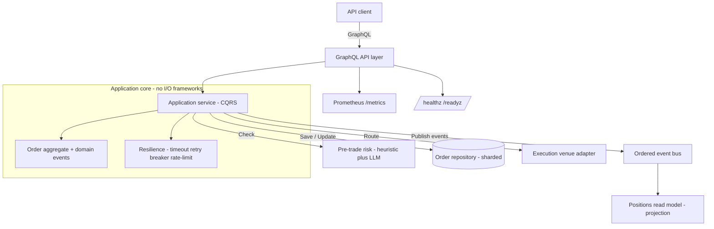
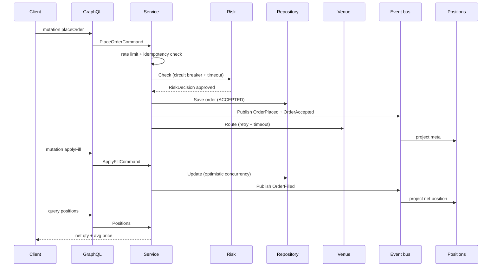
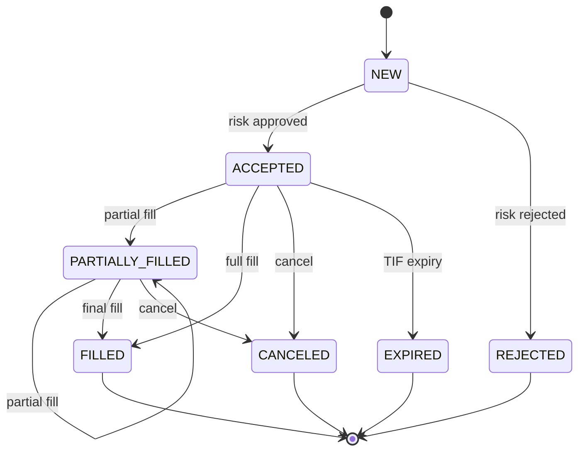

# TradeDesk — Brokerage Order-Management Service

[](https://github.com/ABHIJEET-MUNESHWAR/TradeDesk/actions/workflows/ci.yml)
[](https://go.dev)
[](LICENSE)
[](#test-results)
[](https://github.com/ABHIJEET-MUNESHWAR/TradeDesk/stargazers)
[](https://github.com/ABHIJEET-MUNESHWAR/TradeDesk/issues)
[](https://github.com/ABHIJEET-MUNESHWAR/TradeDesk/commits)

A production-grade **equities order-management system (OMS)** written in Go. It accepts
signed-style order intents over a typed **GraphQL** API, runs them through **pre-trade
risk** (heuristic + optional agentic LLM), drives an **event-sourced order lifecycle**
(CQRS), routes accepted orders to an execution venue with full **resilience** (timeout,
retry, circuit breaker, rate limit), and projects fills into a live **positions read
model** — the off-chain backbone a broker-dealer runs.

## Table of Contents

- [Highlights](#highlights)
- [Architecture](#architecture)
- [Component details](#component-details)
- [Request flows](#request-flows)
- [Order state machine](#order-state-machine)
- [Fixed-point money model](#fixed-point-money-model)
- [GraphQL API](#graphql-api)
- [Configuration](#configuration)
- [Observability](#observability)
- [Getting started](#getting-started)
- [Docker & monitoring stack](#docker--monitoring-stack)
- [Testing](#testing)
- [Test results](#test-results)
- [Benchmarks & complexity](#benchmarks--complexity)
- [Project structure](#project-structure)
- [Design guidelines self-evaluation](#design-guidelines-self-evaluation)

## Highlights

- **Hexagonal architecture** — the domain core imports no web/DB/messaging framework;
  adapters plug into ports, so an in-memory store swaps for Postgres/Kafka with no core
  changes (SOLID, dependency-inversion).
- **CQRS + event-driven** — commands mutate the `Order` aggregate and emit domain events;
  an ordered in-process bus fans them out to a **positions** read-model projection.
- **Resilience on every boundary** — generic (`Operation[T]`) timeout, retry with jittered
  backoff, circuit breaker, token-bucket rate limiter, and bulkhead.
- **Fixed-point money** — overflow-checked integer arithmetic (no floats on the money
  path), so ledger amounts always reconcile; VWAP fills computed with a 256-bit
  intermediate.
- **Agentic AI risk seam** — a deterministic heuristic risk floor that an optional LLM can
  only make *stricter* (never approve what the heuristic rejects), degrading safely to the
  heuristic on any model error.
- **Idempotent, concurrency-safe** — idempotency-keyed order creation and optimistic
  concurrency on every write; the repository is FNV-sharded for low-contention throughput.
- **Fully observable** — structured `slog` JSON logs, Prometheus metrics, health/readiness
  probes, Grafana dashboard, Prometheus alert rules + Alertmanager.

## Architecture



## Component details

| Component | Package | Responsibility |
|---|---|---|
| Order aggregate | `internal/domain` | Lifecycle state machine, VWAP fill math, event emission, snapshots |
| Money / Quantity | `internal/domain` | Overflow-checked fixed-point types (4dp price, 3dp qty) |
| Ports | `internal/ports` | Interfaces: repository, publisher, risk gate, venue, read model, clock, ids |
| Application service | `internal/app` | CQRS command/query orchestration + resilience wiring |
| Risk analysers | `internal/adapters/ai` | Heuristic risk floor + agentic LLM ceiling (fail-safe) |
| Order repository | `internal/adapters/memory` | FNV-sharded store, optimistic concurrency, idempotency |
| Event bus | `internal/adapters/memory` | In-order per-subscriber pub/sub (CQRS write→read) |
| Positions read model | `internal/adapters/memory` | Async projection of net holdings + avg cost |
| Simulated venue | `internal/adapters/memory` | Deterministic execution venue with optional auto-fill |
| Resilience | `internal/resilience` | Generic retry, circuit breaker, rate limiter, bulkhead, timeout |
| System adapters | `internal/adapters/system` | Wall-clock and UUID id generator |
| GraphQL API | `internal/graphqlapi` | Schema, resolvers, HTTP server, health/metrics |
| Observability | `internal/observability` | slog JSON logger + Prometheus metric set |
| Config | `internal/config` | Twelve-factor env configuration with defaults |

## Request flows

**Place → risk → route → fill → projection:**



## Order state machine



The transition table lives in code as an adjacency map (`legalTransitions`), so an illegal
transition is impossible to express and trivial to audit.

## Fixed-point money model

- `Money` is an `int64` in **1/10000-dollar** minor units (4 decimal places).
- `Quantity` is an `int64` in **milli-share** (1/1000) units, supporting fractional shares.
- All arithmetic is overflow-checked; `MulQuantity` / `DivByQuantity` use a `big.Int`
  intermediate so `price × qty` never overflows before the scale divide.
- VWAP on a fill: `avg = (avg·filled + px·qty) / (filled + qty)` with half-away-from-zero
  rounding — verified in tests down to exact cents (e.g. 5@150 + 5@152 → 151.0000).

## GraphQL API

Served at `POST /graphql` (GraphiQL playground on `GET /graphql`).

| Type | Field | Description |
|---|---|---|
| Query | `health` | Service status + circuit-breaker state |
| Query | `order(id)` | Single order by id (null if not found) |
| Query | `orders(limit)` | Recent orders, newest first |
| Query | `positions(accountId)` | Net holdings + average cost per symbol |
| Mutation | `placeOrder(...)` | Place an order (returns id, status, idempotent) |
| Mutation | `cancelOrder(orderId)` | Cancel a working order |
| Mutation | `applyFill(orderId, quantity, price)` | Record an execution |

Seven root operations (>5) justify GraphQL over REST per the project guidelines. Import
[`postman/TradeDesk.postman_collection.json`](postman/TradeDesk.postman_collection.json)
to try it — the collection chains `placeOrder → applyFill → positions` automatically.

## Configuration

All configuration is via environment variables (twelve-factor; an empty value falls back
to the default).

| Variable | Default | Description |
|---|---|---|
| `TRADEDESK_HTTP_ADDR` | `:8080` | Listen address |
| `TRADEDESK_LOG_LEVEL` | `info` | `debug` / `info` / `warn` / `error` |
| `TRADEDESK_RISK_TIMEOUT` | `2s` | Pre-trade risk check timeout |
| `TRADEDESK_ROUTE_TIMEOUT` | `3s` | Per-attempt venue routing timeout |
| `TRADEDESK_RATE_LIMIT_RPS` | `500` | Sustained PlaceOrder rate |
| `TRADEDESK_RATE_LIMIT_BURST` | `200` | Burst capacity |
| `TRADEDESK_BREAKER_FAILURES` | `5` | Failures before the risk breaker opens |
| `TRADEDESK_BREAKER_COOLDOWN` | `5s` | Breaker cool-down before probing |
| `TRADEDESK_RETRY_ATTEMPTS` | `3` | Venue routing retry attempts |
| `TRADEDESK_REPO_SHARDS` | `16` | Order-repository shard count (rounded to pow2) |

## Observability

- **Logs** — structured JSON via `slog` (ready for Loki/ELK).
- **Metrics** — `GET /metrics` exposes `tradedesk_orders_placed_total`,
  `tradedesk_orders_filled_total`, `tradedesk_risk_checks_total`,
  `tradedesk_route_failures_total`, `tradedesk_graphql_requests_total`, and the
  `tradedesk_place_order_seconds` latency histogram.
- **Health** — `GET /healthz` (liveness) and `GET /readyz` (readiness).
- **Dashboards & alerts** — Grafana dashboard + Prometheus alert rules
  (`monitoring/`) with an Alertmanager route.

## Getting started

```bash
# Requires Go 1.26+
go run ./cmd/tradedesk           # starts on :8080
# in another shell:
curl -s -X POST localhost:8080/graphql -H 'Content-Type: application/json' \
  -d '{"query":"mutation{placeOrder(accountId:\"acct-1\",symbol:\"AAPL\",side:\"BUY\",orderType:\"LIMIT\",quantity:\"10\",limitPrice:\"150.00\"){orderId status}}"}'
```

Common `make` targets: `make test`, `make race`, `make cover`, `make bench`, `make lint`,
`make build`, `make docker`.

## Docker & monitoring stack

```bash
docker compose up --build                 # just the service on :8080
docker compose --profile monitoring up    # + Prometheus :9090, Grafana :3000, Alertmanager :9093
```

The image is a multi-stage build onto **distroless nonroot**; because there is no shell,
the container `HEALTHCHECK` runs the binary itself with `--health` (an internal HTTP probe
of `/healthz`).

## Testing

```bash
go test -race -cover ./...
```

The suite covers the domain (money math, state machine, VWAP), the AI risk floor/ceiling
invariants, the sharded repository (idempotency + optimistic concurrency), the ordered
event bus, the positions projection, the full application pipeline, config, and the
GraphQL surface — including the race detector.

## Test results

Real output from `go test -race -cover ./...` (60 tests, all passing):

| Package | Coverage |
|---|---|
| `internal/adapters/system` | 100.0% |
| `internal/config` | 100.0% |
| `internal/observability` | 100.0% |
| `internal/adapters/memory` | 94.9% |
| `internal/resilience` | 87.9% |
| `internal/adapters/ai` | 86.5% |
| `internal/app` | 78.6% |
| `internal/domain` | 75.6% |
| `internal/graphqlapi` | 75.0% |
| **total** | **78.3%** |

## Benchmarks & complexity

From `go test -bench=. -benchmem ./internal/domain/` (Go 1.26, amd64):

| Operation | Time | Allocs | Complexity |
|---|---|---|---|
| `NewOrder` (build + validate) | ~172 ns/op | 3 | O(1) |
| `Fill` (VWAP update) | ~621 ns/op | 14 | O(1) per fill |
| `MulQuantity` (overflow-safe notional) | ~127 ns/op | 6 | O(1) |

Other complexities: repository `Get/Save/Update` are O(1) average (sharded hash map);
`List(limit)` is O(n log n) (sort by recency); positions projection is O(1) per event.

## Project structure

```
TradeDesk/
├── cmd/tradedesk/           # composition root (main)
├── internal/
│   ├── domain/              # Order aggregate, Money/Quantity, events, state machine
│   ├── ports/               # hexagonal interfaces
│   ├── app/                 # CQRS application service
│   ├── adapters/
│   │   ├── memory/          # repository, event bus, read model, venue
│   │   ├── ai/              # heuristic + LLM risk analysers
│   │   └── system/          # clock, id generator
│   ├── resilience/          # retry, breaker, rate limiter, bulkhead, timeout
│   ├── observability/       # slog logger + Prometheus metrics
│   ├── graphqlapi/          # schema, resolvers, HTTP server
│   └── config/              # env configuration
├── monitoring/              # prometheus, alerts, alertmanager, grafana
├── postman/                 # importable GraphQL collection
├── Dockerfile · docker-compose.yml · Makefile · .github/workflows/ci.yml
```

## Design guidelines self-evaluation

See [EVALUATION.md](EVALUATION.md) for a point-by-point mapping of this service against the
30 engineering guidelines (SOLID, CQRS/event-driven, resilience, GraphQL, testing,
observability, CI/CD, Docker, benchmarks, and more).
